# Practical Guide to Reverse Engineering Flutter Applications

## Introduction

Flutter lets teams ship Android and iOS apps from a single Dart codebase, and that convenience has made it very popular. For reverse engineers it changes the job: the app logic is no longer Java, Kotlin, Swift or Objective-C, but Dart compiled ahead of time into a format that standard tools only partly understand.

This guide walks through that process end to end. It starts with where the Dart code lives in an Android and an iOS app, recovers function names with reFlutter, explains why the decompiled Dart code looks broken, and then fixes it in Ghidra: restoring references to Dart objects, teaching Ghidra about the Dart VM stack, and correcting function parameters.

The app used throughout is [*LocalSend*](https://localsend.org/), an open-source Flutter app for sharing files and messages over a local network without an internet connection.

## How a Flutter App Runs

A few pieces of Flutter's runtime explain almost everything that looks odd later in the guide. This section covers just those; the [References](#references) list further reading.

### The Dart VM and AOT Compilation

Dart code runs on the **Dart VM**. During development the VM compiles code **Just-In-Time (JIT)**, which is what makes hot reload possible. Release builds are compiled **Ahead-Of-Time (AOT)** into native ARM64 code instead. AOT removes the JIT compiler from the app, but not the VM's runtime: the app still relies on it for memory management, garbage collection, isolates and loading the compiled code. That runtime is why compiled Dart doesn't look like code produced by a C or Swift compiler.

### Snapshots

AOT output is packaged as **snapshots**: serialized images of compiled code and the objects that code needs. At startup the Dart VM deserializes them onto the Dart heap. There are two kinds, each split into data and instructions:

* **VM snapshot**: code and objects shared by every isolate, such as core library objects and common stubs.
* **Isolate snapshot**: the code and initial heap of an isolate. For the main isolate, this is where the app's own logic lives.

### Isolates

Dart runs concurrent work in **isolates** rather than threads. Each isolate has its own heap and never shares memory with another; isolates communicate by sending messages through ports. When following data through an app, this means there are no shared global structures to find: values cross isolates only as messages.

### The Object Pool

Compiled Dart code doesn't embed pointers to the objects it uses, such as strings and constants. Instead each one gets an entry in the **object pool**, a large array that is itself a Dart object, and code loads objects by their index in it. On ARM64, register **X27** always points to the object pool. This one level of indirection is the main reason disassemblers find no links between Dart code and its data.

### The Heap and Garbage Collection

Objects created at runtime, along with everything deserialized from the snapshots, live on the **Dart heap**, managed by a generational garbage collector. Short-lived objects (most widgets) are collected by frequent, cheap minor collections; long-lived ones survive into the old generation, which is collected less often. For our purposes, the heap matters because it holds the deserialized objects, including the object pool, which is exactly what we'll dump later.

### The Dart VM Stack

Function calls use a call stack as usual, with one important difference: on ARM64, Dart code keeps its own stack and uses **X15** as its stack pointer instead of the system `SP`. This is the cause of the missing parameters and local variables in decompiled Dart code, covered in [Why Decompiled Dart Code Looks Wrong](#why-decompiled-dart-code-looks-wrong).

## A First Look: Android

On Android, a typical first step is to decompile the APK with **JADX-GUI** and look for the app's logic in Java or Kotlin. With a Flutter app, that search ends quickly.

### The Manifest and MainActivity

As with any Android app, `AndroidManifest.xml` declares the components and the launch activity. Here it's `MainActivity`:

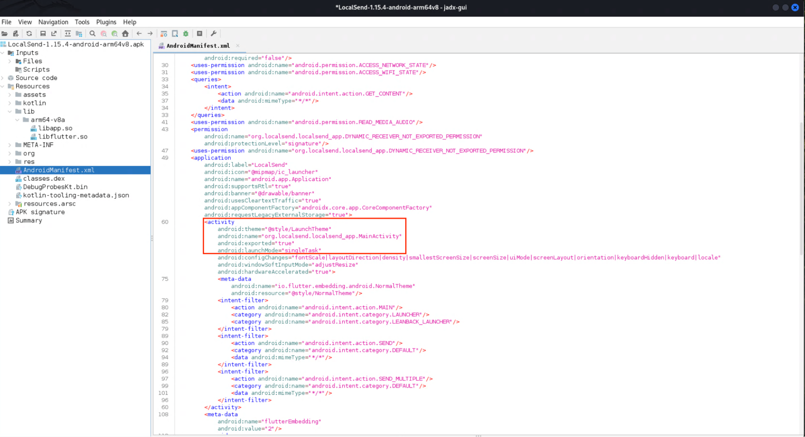

In a native app, `MainActivity` would lead into the UI and business logic. In a Flutter app it does little more than start the Flutter engine and handle a few intents:

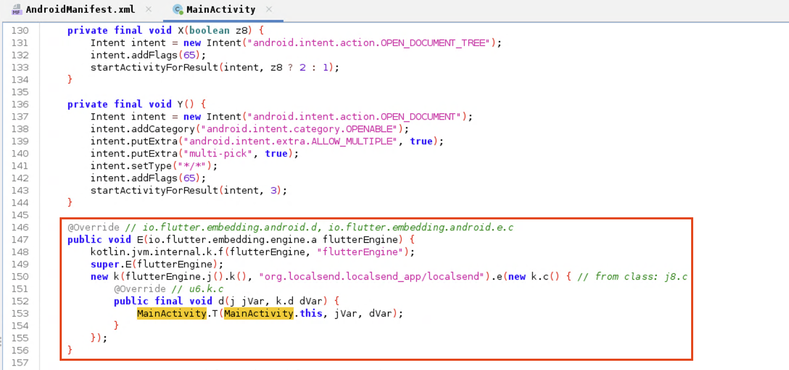

### The Native Libraries

The real work happens in two native libraries that the APK ships and the Flutter embedding loads:

* **`libflutter.so`** is the Flutter engine, written in C++. It contains the Dart VM, renders the UI (with Skia or Impeller), runs the event loop and isolates, and connects Dart code to Android or iOS APIs through platform channels. It's the same for every app built with a given Flutter version.
* **`libapp.so`** is the app itself: its Dart code, AOT-compiled into the snapshots described above. At startup `libflutter.so` loads it and starts the main isolate. This is the library to reverse engineer.

Listing their dynamic symbols with `nm`, `readelf` or `objdump` shows the difference clearly. `libapp.so` exports only a handful of symbols:

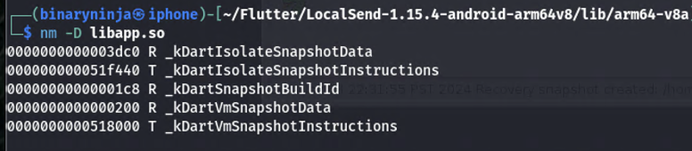

`libflutter.so` exports far more, since it's the engine's interface:

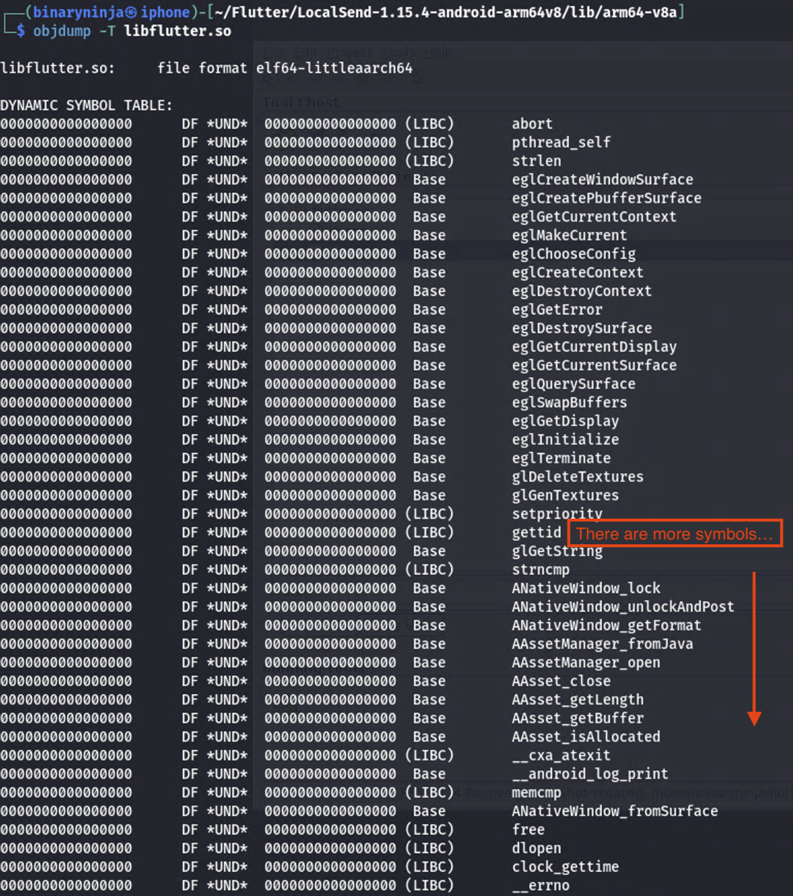

Loading `libapp.so` into **Ghidra** doesn't reveal much more. Its only exports are the snapshot symbols:

* `_kDartVmSnapshotInstructions`
* `_kDartVmSnapshotData`
* `_kDartIsolateSnapshotInstructions`
* `_kDartIsolateSnapshotData`
* `_kDartVmSnapshotBuildId`

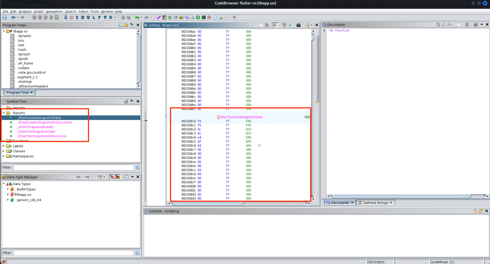

There are no function names, and Ghidra's string search finds strings with no cross-references to the code that uses them. Without understanding the snapshot format, the binary is a large block of anonymous functions.

iOS apps have exactly the same structure, with the app's Dart code in `App.framework/App` instead of `libapp.so`. The rest of this guide works through the iOS version of LocalSend; every technique applies to `libapp.so` on Android too (in the Frida scripts, set `APP_MODULE` to `libapp.so`).

## Locating the Dart Code on iOS

### Requirements

* **Ghidra** \- [https\://ghidra-sre.org/](https://ghidra-sre.org/): for disassembly and decompilation.
* **reFlutter** \- [https\://github.com/Impact-I/reFlutter](https://github.com/Impact-I/reFlutter): for dumping symbol information such as function names.
* **Frida** \- [https\://frida.re/](https://frida.re/): for dumping deserialized Dart objects from memory.
* **r2frida** \- [https\://github.com/nowsecure/r2frida](https://github.com/nowsecure/r2frida): a radare2 and Frida bridge that makes inspecting the running app easier.
* A **decrypted IPA** of the app.
* **LocalSend** \- [https\://apps.apple.com/us/app/localsend/id1661733229](https://apps.apple.com/us/app/localsend/id1661733229): the app reverse engineered in this guide.

### Finding the App Binary

When reverse engineering a native iOS app, the binary to disassemble is the executable at the root of the `<app_name>.app` folder. In a Flutter app that executable (`Runner`) is only the host that starts the engine:

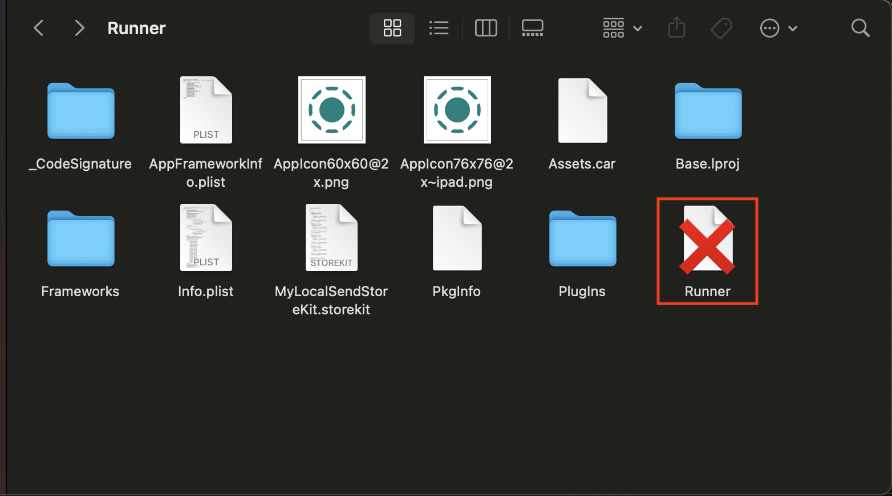

The app's own logic is in `<app_name>.app/Frameworks/App.framework/App`:

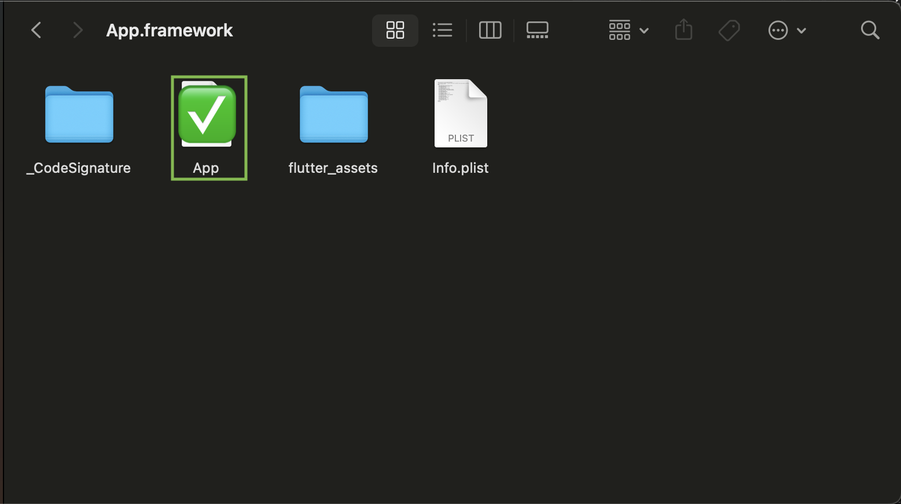

### The Snapshot Symbols

Disassembling `App` in Ghidra shows the same picture as `libapp.so` on Android. The interesting part is the symbol table, which has four exports:

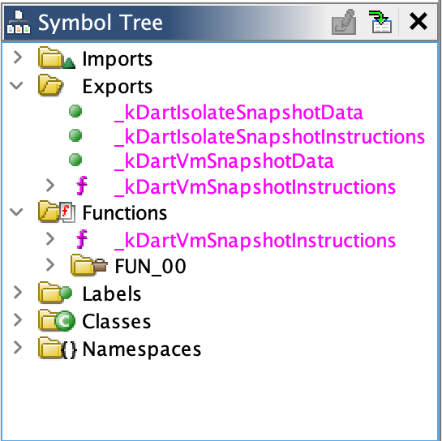

* **`_kDartIsolateSnapshotData`**: the isolate's initial Dart heap, including isolate-specific objects.
* **`_kDartIsolateSnapshotInstructions`**: the AOT-compiled code the isolate executes.
* **`_kDartVmSnapshotData`**: the initial heap shared by all isolates. It speeds up starting isolates but holds nothing isolate-specific.
* **`_kDartVmSnapshotInstructions`**: AOT code for routines shared by all isolates. It's usually very small and mostly stubs.

`_kDartIsolateSnapshotInstructions` is the part we care about: it contains the application code the Dart runtime executes.

## Recovering Function Names with reFlutter

The Dart VM deserializes the snapshot at runtime, so names such as functions and classes exist in memory once the app runs. Getting at them means patching the Dart VM to print them, rebuilding the Flutter engine and swapping it into the app, which is slow to do by hand. [reFlutter](https://github.com/Impact-I/reFlutter) automates it: it patches the engine for the app's Flutter version and repackages the app.

1. Patch the app with reFlutter, following the instructions on its GitHub page:

   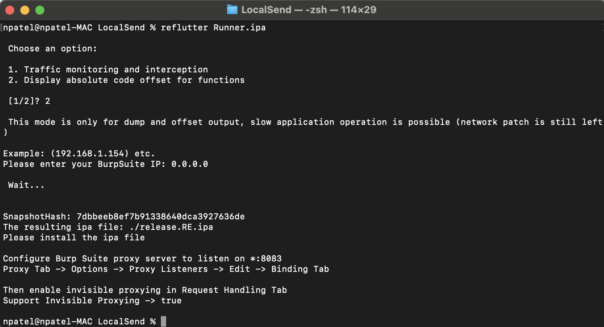

   This produces a patched `release.RE.ipa` next to the original:

   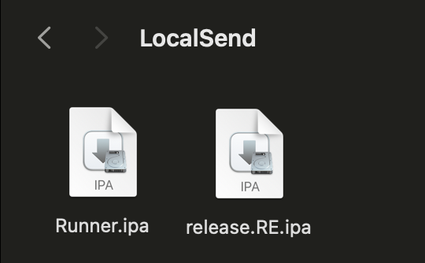

2. Install `release.RE.ipa` on the device.
3. Use the app for a few minutes. The symbols are written to `dump.dart` in the app's folder:

   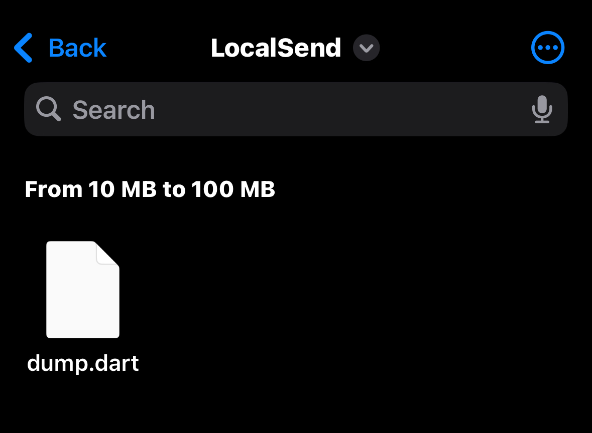

4. Copy `dump.dart` to your computer. From the Files app you can share it (AirDrop works well), or pull it over SSH from the app's data container on a jailbroken device.

### Naming Functions in Ghidra with dump.dart

Before importing the names, the symbol tree is a long list of `FUN_` functions:

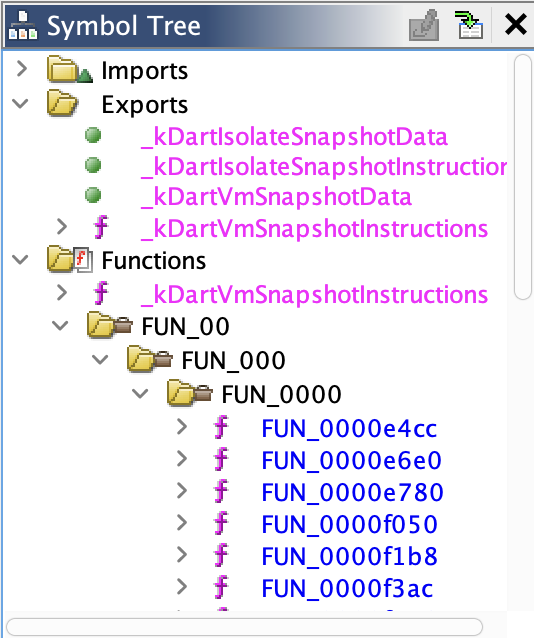

A Ghidra script can read `dump.dart` and name each function. Open **Window > Script Manager**, create a new Java script named `ResolveSymbols` and paste the following code:

```java
// Names the Dart functions in a Flutter app binary using the dump.dart file
// produced by reFlutter (one JSON object per function, concatenated).
//
// Save as ResolveSymbols.java (Ghidra requires the file name to match the class name).
// Before running, set DUMP_FILE_PATH and ISOLATE_SNAPSHOT_INSTRUCTIONS below.
//
//@author Neel Patel
//@category Flutter

import java.io.IOException;
import java.nio.file.Files;
import java.nio.file.Path;
import java.util.HashSet;
import java.util.Set;

import ghidra.app.cmd.disassemble.DisassembleCommand;
import ghidra.app.cmd.function.CreateFunctionCmd;
import ghidra.app.script.GhidraScript;
import ghidra.program.model.address.Address;
import ghidra.program.model.symbol.SourceType;

public class ResolveSymbols extends GhidraScript {

    /** Path to the dump.dart file pulled from the device. */
    private static final String DUMP_FILE_PATH = "<path to dump.dart>";

    /**
     * Address of the _kDartIsolateSnapshotInstructions export (see the Symbol Tree).
     * Offsets in dump.dart are relative to it.
     */
    private static final String ISOLATE_SNAPSHOT_INSTRUCTIONS = "<address, e.g. 0x0000e240>";

    private int createdCount = 0;
    private int existingCount = 0;
    private int failedCount = 0;

    @Override
    public void run() throws Exception {
        long instructionsBase = parseHex(ISOLATE_SNAPSHOT_INSTRUCTIONS);
        String dump = readDumpFile();

        // dump.dart is a series of JSON objects written back to back: {...}{...}{...}
        String[] entries = dump.trim().split("\\}\\{");
        Set<String> seenEntries = new HashSet<>();
        int skippedCount = 0;

        for (String rawEntry : entries) {
            monitor.checkCancelled();

            String entry = rawEntry.replaceFirst("^\\{", "").replaceFirst("\\}$", "");
            if (!seenEntries.add(entry)) {
                continue; // the same function can be dumped more than once
            }

            String methodName = null;
            String offset = null;
            // Each entry looks like: "method_name":"build","offset":"0x0001a2b0","library_url":"...","class_name":"..."
            for (String pair : entry.split(",")) {
                String[] keyAndValue = pair.split(":", 2); // limit 2: Dart names such as "get:foo" contain ':'
                if (keyAndValue.length < 2) {
                    continue;
                }
                String key = unquote(keyAndValue[0]);
                String value = unquote(keyAndValue[1]);
                if (key.equals("method_name")) {
                    methodName = value;
                } else if (key.equals("offset")) {
                    offset = value;
                }
            }

            if (methodName == null || offset == null) {
                skippedCount++;
                continue;
            }
            defineFunction(toAddr(instructionsBase + parseHex(offset)), methodName);
        }

        println(String.format("Done: %d functions created, %d already existed, %d failed, %d entries skipped.",
                createdCount, existingCount, failedCount, skippedCount));
    }

    /** Disassembles the code at {@code address} and defines a function there named {@code name}. */
    private void defineFunction(Address address, String name) {
        if (getFunctionAt(address) != null) {
            existingCount++;
            return;
        }

        DisassembleCommand disassemble = new DisassembleCommand(address, null, true);
        if (!disassemble.applyTo(currentProgram)) {
            println("Disassembly failed at " + address + " (" + name + ")");
        }

        CreateFunctionCmd createFunction = new CreateFunctionCmd(name, address, null, SourceType.USER_DEFINED);
        if (createFunction.applyTo(currentProgram)) {
            createdCount++;
        } else {
            failedCount++;
            println("Failed to create function " + name + " at " + address);
        }
    }

    private String readDumpFile() throws IOException {
        try {
            return Files.readString(Path.of(DUMP_FILE_PATH));
        } catch (IOException e) {
            printerr("Could not read " + DUMP_FILE_PATH + ": set DUMP_FILE_PATH at the top of the script.");
            throw e;
        }
    }

    private static String unquote(String text) {
        return text.replace("\"", "").trim();
    }

    /** Parses "0x1a2b" or "1a2b" as hexadecimal. Uses long: rebased addresses exceed 32 bits. */
    private static long parseHex(String text) {
        String digits = text.trim();
        if (digits.startsWith("0x") || digits.startsWith("0X")) {
            digits = digits.substring(2);
        }
        return Long.parseLong(digits, 16);
    }
}
```

In the script, set `DUMP_FILE_PATH` to the path of `dump.dart` and `ISOLATE_SNAPSHOT_INSTRUCTIONS` to the address of `_kDartIsolateSnapshotInstructions`, which Ghidra shows at the symbol:

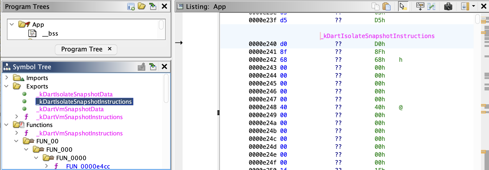

After running the script, the symbol tree shows the original Dart function names:

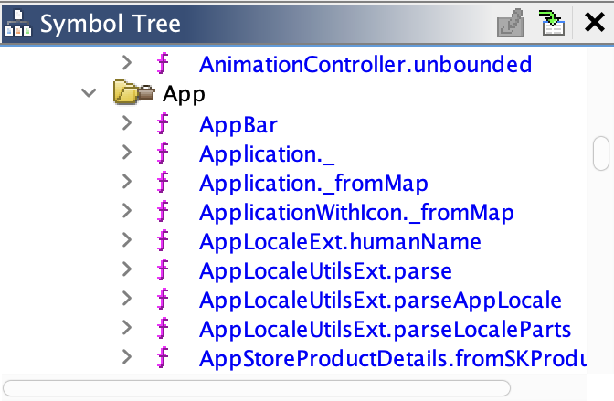

| *❗Note: Up to this point the binary is unchanged and could still be patched and repackaged. The steps that follow modify it in ways that make that impossible; they exist only to make analysis easier.* |
| :---- |

## Why Decompiled Dart Code Looks Wrong

Function names help, but the decompiled code still has two problems. Both come from the runtime details described in [How a Flutter App Runs](#how-a-flutter-app-runs).

### No References Between Code and Data

Searching for a string in Ghidra finds it, but nothing in the code refers to it:

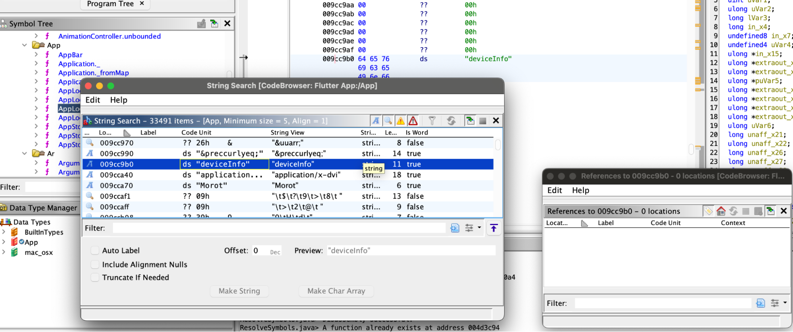

The reason is the object pool. When the app is compiled, Dart serializes every object into the snapshot; when the app starts, the runtime deserializes them onto the Dart heap. Code never points at either copy directly. It reaches each object through its index in the object pool, and the pool's location is only known at runtime:

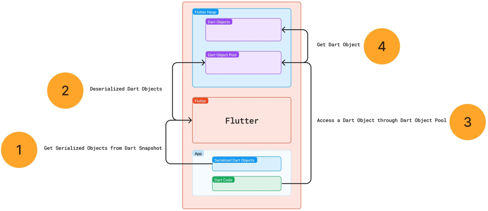

In the disassembly, every such access is a load relative to **X27**, the object pool register. Here an object is loaded into **X4**:

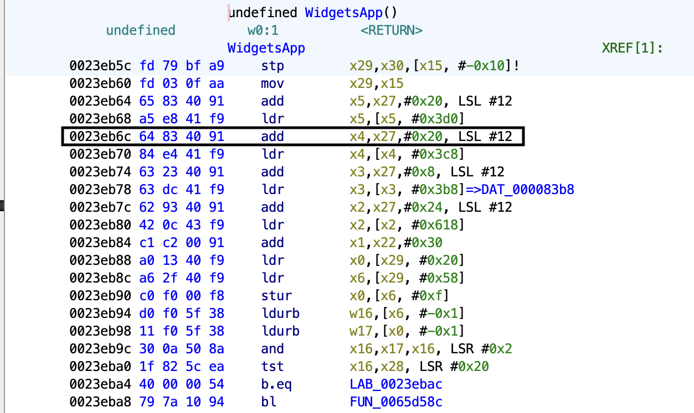

Since Ghidra doesn't know what X27 holds, it can't tell which object is loaded, so it adds no reference.

### Missing Parameters and Local Variables

The second problem is in function signatures: decompiled Dart functions have no parameters and no local variables.

Decompilers infer both by assuming the platform's standard calling convention. On ARM64 that means two checks:

* If one of the argument registers **X0–X7** is read before the function writes to it, it's probably a parameter. For example, reading **X3** first suggests at least four parameters, X0 to X3.
* Accesses to the caller's part of the system stack (through **SP**) are additional parameters, for functions with more than eight. Other stack accesses are local variables.

Dart breaks both checks. It passes nearly all arguments on its own stack rather than in X0–X7, so those registers are always written before they're read, and the decompiler concludes they aren't parameters. And because that stack is addressed through **X15** rather than SP, the decompiler doesn't recognize the arguments pushed there, or the local variables stored there, as stack accesses at all.

## Cleaning Up the Decompiled Code

Neither problem is fundamental to Dart; both come from tools assuming native conventions. That makes them fixable, in three steps:

1. **Restore references** between Dart code and Dart objects, and make the objects visible in decompiled code.
2. **Treat the Dart VM stack as the regular stack**, so Ghidra sees stack accesses.
3. **Correct the calling convention** of Dart functions, so parameters are identified correctly.

## Restoring References to Dart Objects

The snapshot in the binary holds objects in serialized form, while code uses the deserialized objects through the object pool. Restoring references therefore takes several steps:

1. Get the deserialized objects by dumping the Dart heap from the running app.
2. Load the dump into Ghidra.
3. Define the object pool and the objects it points to.
4. Tell Ghidra the value of X27, so it can resolve each object pool access to the object it loads.

### Dumping the Flutter Heap

The deserialized objects only exist in memory, so we dump the heap with Frida. The first script hooks a Dart function the app calls often (here `getTheme`) and prints the addresses we need, read from the registers while Dart code is running: the object pool from X27 and the heap base from X23:

```js
// Prints the addresses needed to dump the Flutter heap.
// Usage: frida -U -f <bundle id / package name> -l flutter-heap-info.js
//
// It hooks a Dart function the app calls regularly. While Dart code runs on
// ARM64, two registers point at what we need:
//   X27  the object pool
//   X23  the heap base (for the Dart version used by this app)

const APP_MODULE = 'App'; // the Flutter app binary: 'App' on iOS, 'libapp.so' on Android

// Offset of a frequently called Dart function inside APP_MODULE (here getTheme, found in Ghidra).
const HOOK_OFFSET = 0x3a0ef8;

// Keeps the high bits of an address, which identify the memory region the heap lives in.
const HEAP_REGION_MASK = 0xf00000000;

/** Readable memory ranges in the same region as the heap base (where the heap and object pool live). */
function findHeapRanges(heapBase) {
  const heapRegion = heapBase.and(HEAP_REGION_MASK);
  return Process.enumerateRanges('r--').filter((range) => range.base.and(HEAP_REGION_MASK).equals(heapRegion));
}

function printAddresses(appBase, heapBase, objectPool) {
  findHeapRanges(heapBase).forEach((range) => console.log(range.base));
  console.log(`App Binary Base Address: ${appBase}`);
  console.log(`Heap Base Address (X23): ${heapBase}`);
  console.log(`Object Pool Address (X27): ${objectPool}`);
  console.log(`Number of Objects in the Object Pool: ${objectPool.add(0x8).readPointer()}`);
  console.log(`Heap bitmask: ${heapBase.and(HEAP_REGION_MASK)}`);
}

function hookDartFunction() {
  const app = Process.findModuleByName(APP_MODULE);
  if (app === null) {
    setTimeout(hookDartFunction, 500); // the Flutter binary isn't loaded yet: try again shortly
    return;
  }

  console.log('\nWaiting for the app to call the hooked function...');
  let hasPrinted = false;
  Interceptor.attach(app.base.add(HOOK_OFFSET), {
    onEnter() {
      if (hasPrinted) return; // the function runs often; the addresses only need printing once
      hasPrinted = true;
      printAddresses(app.base, this.context.x23, this.context.x27);
    },
  });
}

hookDartFunction();
```

Its output looks like this:

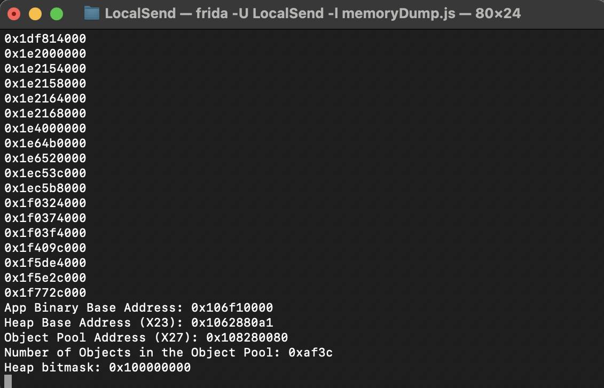

Run it a few times and the heap base and object pool addresses change on every launch. Dumping the whole process isn't practical either, as it's very large. Instead we can rely on the heap and the object pool sitting in the same region of memory as the heap base: masking off the low bits of an address (`HEAP_REGION_MASK`) identifies that region, and only the readable ranges in it need dumping. The second script does that and writes each range to its own file, named after its start address:

```js
// Dumps the Flutter heap (including the object pool) to files on the device,
// one file per memory range, named after its start address, plus ranges.json.
// Usage: frida -U -f <bundle id / package name> -l flutter-heap-dump.js
//
// Like the previous script, it hooks a regularly called Dart function and
// reads the heap base (X23) and object pool (X27) from its registers.

const APP_MODULE = 'App'; // the Flutter app binary: 'App' on iOS, 'libapp.so' on Android

// Offset of a frequently called Dart function inside APP_MODULE (here getTheme, found in Ghidra).
const HOOK_OFFSET = 0x3a0ef8;

// Keeps the high bits of an address, which identify the memory region the heap lives in.
const HEAP_REGION_MASK = 0xf00000000;

// Where dump files are written. Must be writable by the app; r2frida's `:i`
// shows the app's home directory (its Documents folder works well).
const DUMP_DIRECTORY = '/var/tmp/';

/** Readable memory ranges in the same region as the heap base (where the heap and object pool live). */
function findHeapRanges(heapBase) {
  const heapRegion = heapBase.and(HEAP_REGION_MASK);
  return Process.enumerateRanges('r--').filter((range) => range.base.and(HEAP_REGION_MASK).equals(heapRegion));
}

function writeFile(path, data) {
  const file = new File(path, 'wb');
  file.write(data);
  file.close();
}

/** Writes every heap range to DUMP_DIRECTORY, plus ranges.json describing all readable ranges. */
function dumpHeap(heapBase) {
  writeFile(`${DUMP_DIRECTORY}ranges.json`, JSON.stringify(Process.enumerateRanges('r--'), null, 2));

  for (const range of findHeapRanges(heapBase)) {
    const path = `${DUMP_DIRECTORY}${range.base}`;
    try {
      console.log(`Dumping memory into ${path}`);
      writeFile(path, range.base.readByteArray(range.size));
    } catch (error) {
      // Some ranges can't be read even though they're marked readable; skip them.
      console.log(`Skipped ${range.base}: ${error}`);
    }
  }
}

function printAddresses(appBase, heapBase, objectPool) {
  console.log(`App Binary Base Address: ${appBase}`);
  console.log(`Heap Base Address (X23): ${heapBase}`);
  console.log(`Object Pool Address (X27): ${objectPool}`);
  console.log(`Number of Objects in the Object Pool: ${objectPool.add(0x8).readPointer()}`);
  console.log(`Heap bitmask: ${heapBase.and(HEAP_REGION_MASK)}`);
}

function hookDartFunction() {
  const app = Process.findModuleByName(APP_MODULE);
  if (app === null) {
    setTimeout(hookDartFunction, 500); // the Flutter binary isn't loaded yet: try again shortly
    return;
  }

  console.log('\nWaiting for the app to call the hooked function...');
  let hasDumped = false;
  Interceptor.attach(app.base.add(HOOK_OFFSET), {
    onEnter() {
      if (hasDumped) return; // the function runs often; one dump is enough
      hasDumped = true;
      const heapBase = this.context.x23;
      dumpHeap(heapBase);
      printAddresses(app.base, heapBase, this.context.x27);
    },
  });
}

hookDartFunction();
```

The dump files must go somewhere the app can write to, such as its own Documents folder. r2frida's `:i` command shows where the app is installed:

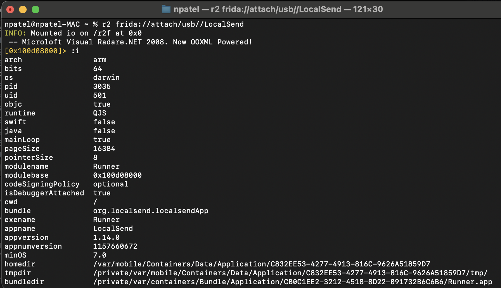

Set `DUMP_DIRECTORY` to that folder and run the script:

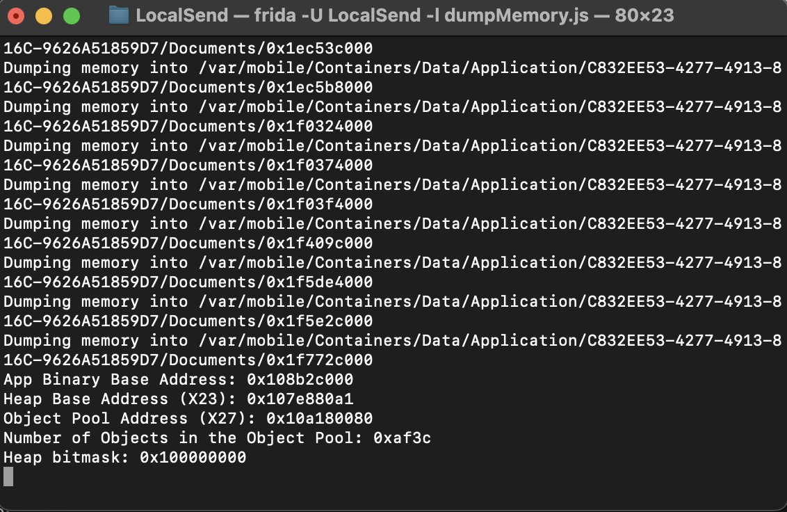

Every range in the heap's region was dumped, and the object pool address falls inside one of them. **Note down the printed addresses**: the app base, heap base and object pool addresses are all needed in Ghidra. Then copy the dump files from the device to your computer:

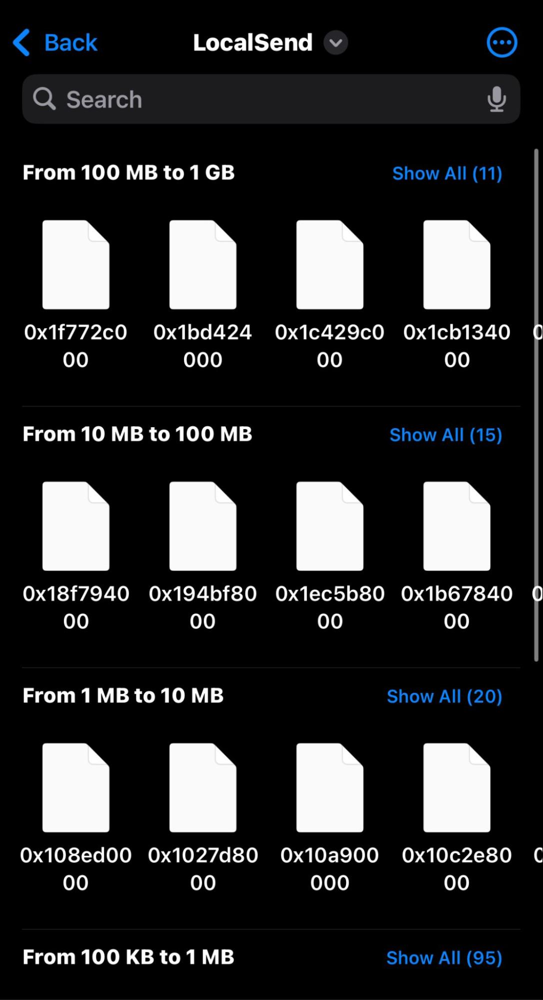

### Importing the Memory Dump into Ghidra

The dump's addresses come from the running app, so the binary's image base in Ghidra must match the base address the app was loaded at. Open **Window > Memory Map**:

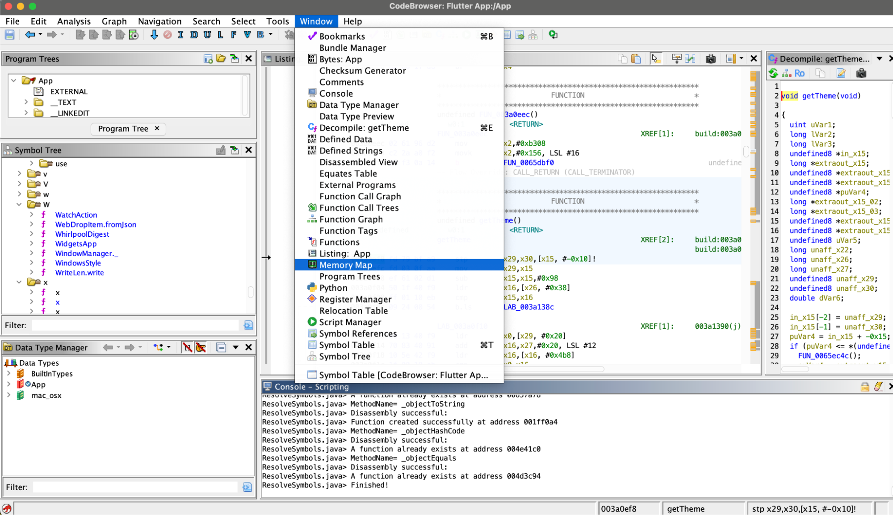

Click **Set Image Base** at the top right:

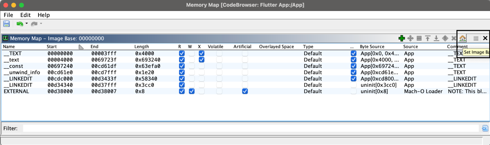

Enter the app binary base address printed by the dump script:

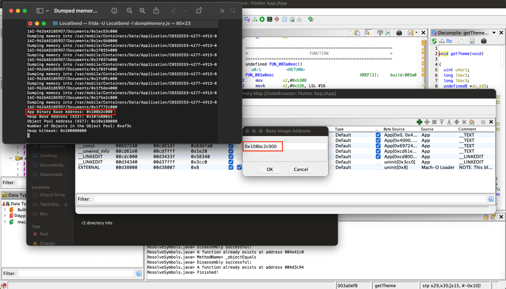

| ❗Make sure to set the image base before importing the memory dump into Ghidra. |
| :---- |

Put the dump files in a folder of their own:

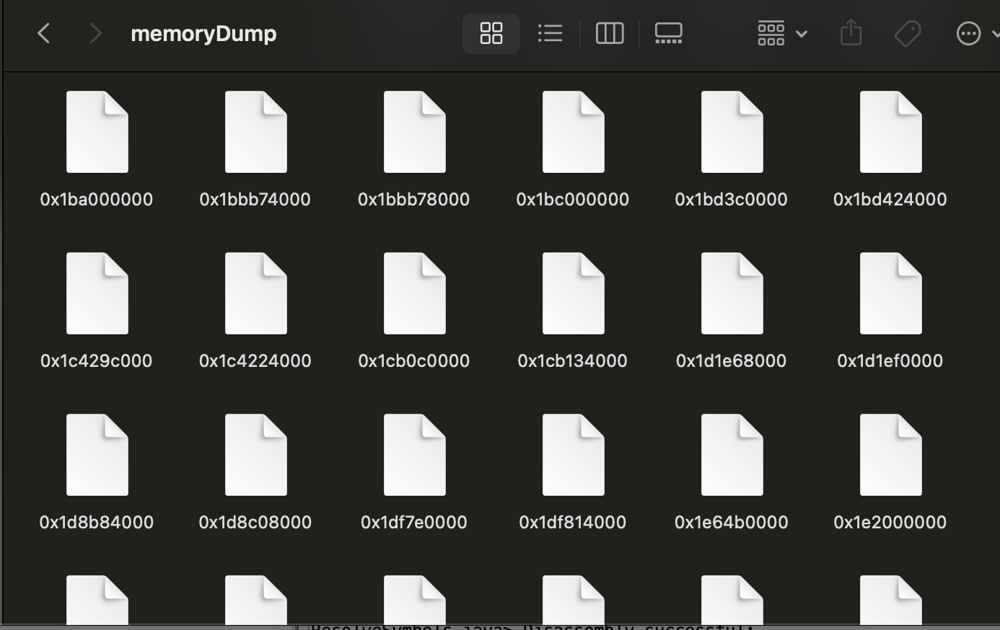

The following Ghidra script imports every file in that folder as a memory block at the address in its name:

```java
// Imports the memory ranges dumped by the Frida script as initialized memory
// blocks, each at the address in its file name (e.g. 0x1ba000000).
//
// Save as ImportMemoryDump.java. Set the binary's image base first (Window > Memory Map).
//
//@author Neel Patel
//@category Flutter

import java.io.BufferedInputStream;
import java.io.File;
import java.io.FileInputStream;
import java.io.InputStream;
import java.util.Arrays;
import java.util.Comparator;

import ghidra.app.script.GhidraScript;
import ghidra.program.model.mem.Memory;

public class ImportMemoryDump extends GhidraScript {

    /** Dump files are named after their start address, e.g. 0x1ba000000. Other files (ranges.json) are ignored. */
    private static final String DUMP_FILE_NAME = "0x[0-9a-fA-F]+";

    @Override
    public void run() throws Exception {
        File folder = askDirectory("Select the folder with the memory dumps", "Import");
        File[] dumpFiles = folder.listFiles((file) -> file.isFile() && file.getName().matches(DUMP_FILE_NAME));
        if (dumpFiles == null || dumpFiles.length == 0) {
            printerr("No memory dump files (named like 0x1ba000000) found in " + folder);
            return;
        }
        Arrays.sort(dumpFiles, Comparator.comparing(File::getName));

        Memory memory = currentProgram.getMemory();
        int importedCount = 0;
        for (File dumpFile : dumpFiles) {
            monitor.checkCancelled();
            String name = dumpFile.getName();
            long startAddress = Long.parseLong(name.substring(2), 16);

            // Stream the file straight into a new block (no size limit from loading it into one array).
            try (InputStream input = new BufferedInputStream(new FileInputStream(dumpFile))) {
                memory.createInitializedBlock(name, toAddr(startAddress), input, dumpFile.length(), monitor, false);
                importedCount++;
                println("Imported " + name + " (" + dumpFile.length() + " bytes)");
            } catch (Exception e) {
                printerr("Failed to import " + name + ": " + e.getMessage());
            }
        }

        println(String.format("Imported %d of %d memory dump files.", importedCount, dumpFiles.length));
    }
}
```

After running it, the Memory Map shows the imported ranges:

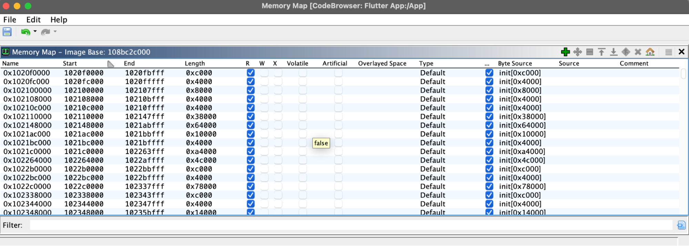

### Defining the Object Pool

Jumping to the object pool address shows that it is still raw bytes. In this run the pool starts at `0x10a180080`:

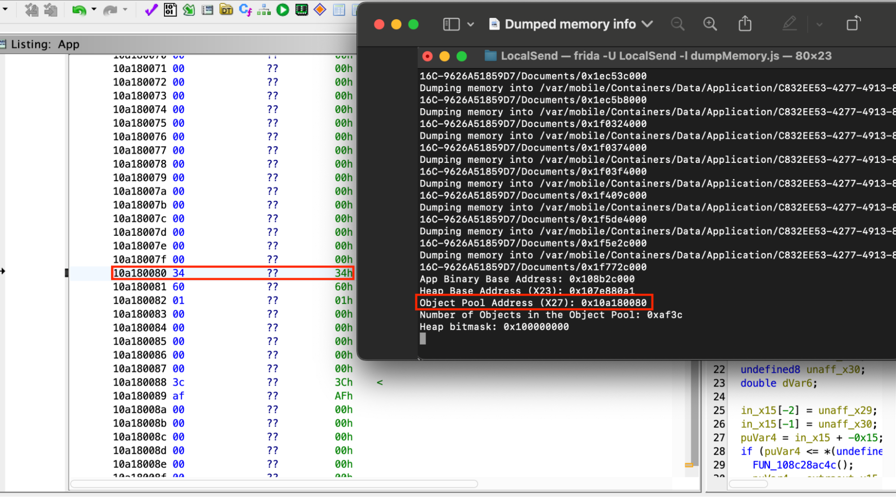

To define it, we need its layout. Every Dart object starts with a 4-byte tag that includes its class ID (`cid`):

```c
// Header at the start of every Dart object (4 bytes).
struct DartObjectTag {
    uint8_t  is_canonical_and_gc; // garbage-collector and canonical-object flag bits
    uint8_t  size_tag;            // encoded object size
    uint16_t cid;                 // class ID: which Dart class this object is an instance of
};
```

The object pool is itself a Dart object, so it starts with that tag. The number of entries follows at offset 8, and the array of pointers to the objects starts at offset 0x10:

```c
struct DartObjectPool {
    struct DartObjectTag tag;                // 0x00, followed by 4 bytes of padding
    int64_t object_count;                    // 0x08  number of entries in the pool
    struct DartObject *object_pool_array[];  // 0x10  tagged pointers to Dart objects
};
```

The pointers in the array are odd numbers because of Dart's **pointer tagging**: the lowest bit marks a value as a pointer to an object, while values with the bit clear are small integers (Smis) stored directly, which saves allocating an object for each one. To get an object's real address, subtract one from its pointer.

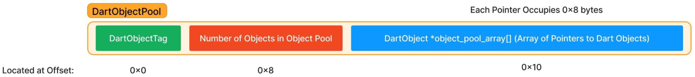

The following script turns the pool's entries into pointers (**set `OBJECT_POOL_ADDRESS` to your object pool address**; the number of entries is read from the pool itself):

```java
// Turns the Dart object pool's entries into pointers so Ghidra can follow them.
// Entries with the low bit set are (tagged) object pointers; others are small
// integers and are left as they are.
//
// Save as CreateObjectPoolPointers.java. Set OBJECT_POOL_ADDRESS below (X27
// from the Frida dump output); the number of entries is read from the pool itself.
//
//@author Neel Patel
//@category Flutter

import ghidra.app.script.GhidraScript;
import ghidra.program.model.address.Address;
import ghidra.program.model.data.PointerDataType;

public class CreateObjectPoolPointers extends GhidraScript {

    /** Address of the Dart object pool: the value of X27 in the Frida output. */
    private static final long OBJECT_POOL_ADDRESS = 0x10a180080L;

    /** Pool layout: 8-byte tag, 8-byte entry count, then the array of 8-byte entries. */
    private static final int OBJECT_COUNT_OFFSET = 0x8;
    private static final int ENTRIES_OFFSET = 0x10;
    private static final int ENTRY_SIZE = 8;

    @Override
    public void run() throws Exception {
        Address pool = toAddr(OBJECT_POOL_ADDRESS);
        long entryCount = getLong(pool.add(OBJECT_COUNT_OFFSET));
        monitor.initialize(entryCount, "Creating object pool pointers");

        int pointerCount = 0;
        for (long index = 0; index < entryCount; index++) {
            monitor.checkCancelled();
            monitor.incrementProgress(1);

            Address entry = pool.add(ENTRIES_OFFSET + index * ENTRY_SIZE);
            long value = getLong(entry);
            if ((value & 1) == 0) {
                continue; // even values are small integers, not pointers
            }

            clearListing(entry, entry.add(ENTRY_SIZE - 1));
            createData(entry, PointerDataType.dataType);
            pointerCount++;
        }

        println(String.format("Created %d pointers out of %d object pool entries.", pointerCount, entryCount));
    }
}
```

After running it, the pool shows pointers to Dart objects:

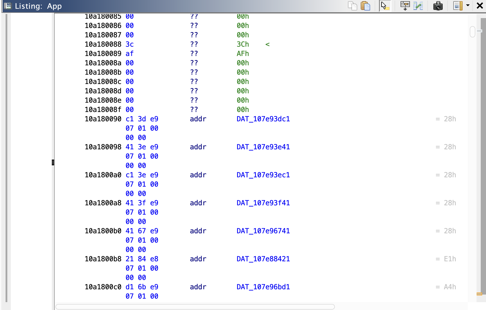

### Defining Dart Objects

Ghidra still knows nothing about the objects themselves; they show up as undefined bytes:

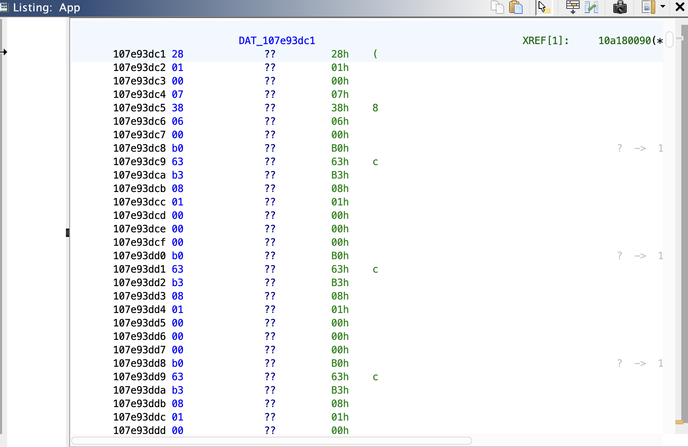

Strings are the most useful objects to define first. A one-byte Dart string looks like this:

```c
struct DartString {
    uint8_t  is_canonical_and_gc; // 0x00 \
    uint8_t  size_tag;            // 0x01  | DartObjectTag
    uint16_t cid;                 // 0x02 /
    uint32_t padding;             // 0x04  aligns s_len to 8 bytes
    int64_t  s_len;               // 0x08  stored as a small integer (Smi): real length = s_len >> 1
    char     s[];                 // 0x10  the characters, one byte each
};
```

The next script walks the object pool and defines a `DartString` structure for every string it points to, named after its text:

```java
// Walks the Dart object pool and defines a DartString structure for every
// one-byte string it points to, naming each structure after the string's text.
//
// Save as CreateDartStrings.java. Set OBJECT_POOL_ADDRESS below (X27 from the
// Frida dump output). Check STRING_CLASS_IDS for your app's Dart version.
//
//@author Neel Patel
//@category Flutter

import java.util.Set;

import ghidra.app.script.GhidraScript;
import ghidra.program.model.address.Address;
import ghidra.program.model.data.ByteDataType;
import ghidra.program.model.data.DWordDataType;
import ghidra.program.model.data.DataUtilities;
import ghidra.program.model.data.DataUtilities.ClearDataMode;
import ghidra.program.model.data.QWordDataType;
import ghidra.program.model.data.ShortDataType;
import ghidra.program.model.data.StringDataType;
import ghidra.program.model.data.Structure;
import ghidra.program.model.data.StructureDataType;

public class CreateDartStrings extends GhidraScript {

    /** Address of the Dart object pool: the value of X27 in the Frida output. */
    private static final long OBJECT_POOL_ADDRESS = 0x10a180080L;

    /** Pool layout: 8-byte tag, 8-byte entry count, then the array of 8-byte entries. */
    private static final int OBJECT_COUNT_OFFSET = 0x8;
    private static final int ENTRIES_OFFSET = 0x10;
    private static final int ENTRY_SIZE = 8;

    /** Class IDs of one-byte strings in this app's Dart version (they vary between versions). */
    private static final Set<Integer> STRING_CLASS_IDS = Set.of(0x5, 0x55);

    /** DartString layout (see the struct above): length at 0x8, characters from 0x10. */
    private static final int CID_OFFSET = 0x2;
    private static final int LENGTH_OFFSET = 0x8;
    private static final int CHARS_OFFSET = 0x10;

    @Override
    public void run() throws Exception {
        Address pool = toAddr(OBJECT_POOL_ADDRESS);
        long entryCount = getLong(pool.add(OBJECT_COUNT_OFFSET));
        monitor.initialize(entryCount, "Creating Dart strings");

        int createdCount = 0;
        for (long index = 0; index < entryCount; index++) {
            monitor.checkCancelled();
            monitor.incrementProgress(1);

            Address entry = pool.add(ENTRIES_OFFSET + index * ENTRY_SIZE);
            try {
                long value = getLong(entry);
                // Pointers in the pool are tagged: the low bit is set, so the object starts at value - 1.
                if (value <= 0 || (value & 1) == 0) {
                    continue; // empty slot or small integer
                }
                Address object = toAddr(value - 1);
                int classId = getShort(object.add(CID_OFFSET)) & 0xFFFF;
                if (STRING_CLASS_IDS.contains(classId) && createDartString(object)) {
                    createdCount++;
                }
            } catch (Exception e) {
                printerr("Skipped entry at " + entry + ": " + e.getMessage());
            }
        }

        println(String.format("Created %d DartString structures from %d object pool entries.", createdCount, entryCount));
    }

    /**
     * Defines a DartString structure at {@code address}, named after the string's text.
     *
     * @return true if the structure was created
     */
    private boolean createDartString(Address address) {
        try {
            int length = (int) (getLong(address.add(LENGTH_OFFSET)) >> 1); // s_len is a Smi
            if (length <= 0) {
                return false;
            }
            String text = readOneByteString(address.add(CHARS_OFFSET), length);

            Structure dartString = new StructureDataType(toTypeName(text), 0);
            dartString.add(ByteDataType.dataType, "is_canonical_and_gc", null);
            dartString.add(ByteDataType.dataType, "size_tag", null);
            dartString.add(ShortDataType.dataType, "cid", null);
            dartString.add(DWordDataType.dataType, "padding", null); // aligns s_len to 8 bytes
            dartString.add(QWordDataType.dataType, "s_len", null);
            dartString.add(StringDataType.dataType, length, "s", null);

            DataUtilities.createData(currentProgram, address, dartString, dartString.getLength(),
                    ClearDataMode.CLEAR_ALL_UNDEFINED_CONFLICT_DATA);
            return true;
        } catch (Exception e) {
            printerr("Failed to create DartString at " + address + ": " + e.getMessage());
            return false;
        }
    }

    private String readOneByteString(Address start, int length) throws Exception {
        StringBuilder text = new StringBuilder(length);
        for (int i = 0; i < length; i++) {
            text.append((char) (getByte(start.add(i)) & 0xFF));
        }
        return text.toString();
    }

    /** Ghidra type names can't contain '/' (it separates categories) and get unwieldy when long. */
    private static String toTypeName(String text) {
        String name = text.replace('/', '_').replaceAll("\\s+", " ").trim();
        return name.length() > 100 ? name.substring(0, 100) : name;
    }
}
```

The strings now appear as proper structures:

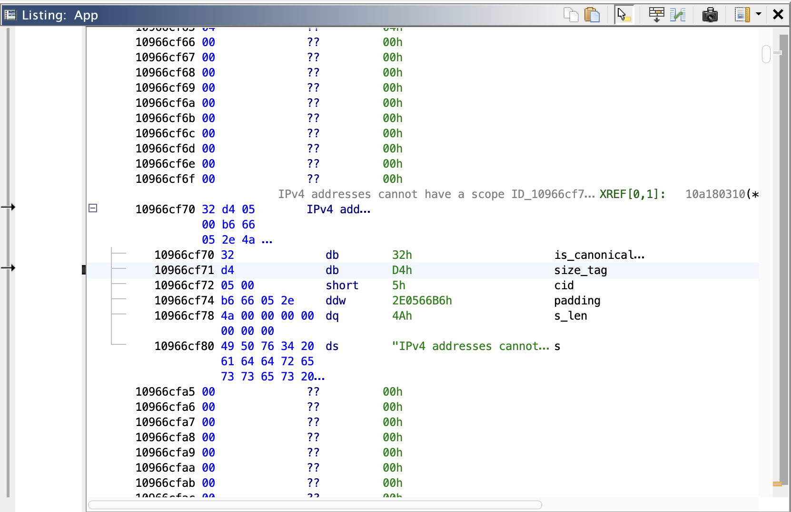

One more change is needed in the pool itself. Its pointers are still tagged, so each one points one byte past the start of its object, and Ghidra can't link it to the `DartString` structure. The following script untags them by subtracting one from every pointer:

```java
// Untags the Dart object pool's pointers (subtracts 1) so they point at the
// start of each object and Ghidra links them to the DartString structures.
// Run it after CreateDartStrings.java, which reads the original tagged values.
//
// Save as UntagObjectPoolPointers.java. Set OBJECT_POOL_ADDRESS below (X27
// from the Frida dump output); the number of entries is read from the pool itself.
//
//@author Neel Patel
//@category Flutter

import ghidra.app.script.GhidraScript;
import ghidra.program.model.address.Address;
import ghidra.program.model.data.PointerDataType;

public class UntagObjectPoolPointers extends GhidraScript {

    /** Address of the Dart object pool: the value of X27 in the Frida output. */
    private static final long OBJECT_POOL_ADDRESS = 0x10a180080L;

    /** Pool layout: 8-byte tag, 8-byte entry count, then the array of 8-byte entries. */
    private static final int OBJECT_COUNT_OFFSET = 0x8;
    private static final int ENTRIES_OFFSET = 0x10;
    private static final int ENTRY_SIZE = 8;

    @Override
    public void run() throws Exception {
        Address pool = toAddr(OBJECT_POOL_ADDRESS);
        long entryCount = getLong(pool.add(OBJECT_COUNT_OFFSET));
        monitor.initialize(entryCount, "Untagging object pool pointers");

        int untaggedCount = 0;
        for (long index = 0; index < entryCount; index++) {
            monitor.checkCancelled();
            monitor.incrementProgress(1);

            Address entry = pool.add(ENTRIES_OFFSET + index * ENTRY_SIZE);
            long value = getLong(entry);
            if ((value & 1) == 0) {
                continue; // small integer, or already untagged by an earlier run
            }

            clearListing(entry, entry.add(ENTRY_SIZE - 1));
            setLong(entry, value - 1); // remove the tag bit: now points at the object's first byte
            createData(entry, PointerDataType.dataType);
            untaggedCount++;
        }

        println(String.format("Untagged %d pointers out of %d object pool entries.", untaggedCount, entryCount));
    }
}
```

The object pool pointers now point at the right addresses:

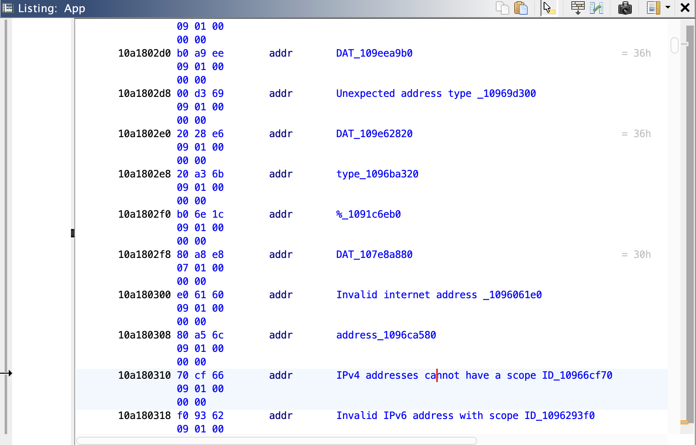

Some strings are used by code but aren't referenced from the object pool, so they are still unresolved:

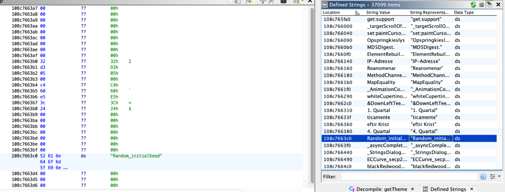

The script below finds every string Ghidra has detected that isn't a Dart object yet and wraps it in a `DartString` structure:

```java
// Finds strings Ghidra has detected that aren't Dart objects yet (strings used
// by code but not referenced from the object pool) and wraps each in a
// DartString structure. A string's characters start 0x10 bytes into its
// DartString, so the structure is created 0x10 bytes before the string.
//
// Save as CreateRemainingDartStrings.java.
//
//@author Neel Patel
//@category Flutter

import java.util.ArrayList;
import java.util.List;

import ghidra.app.script.GhidraScript;
import ghidra.program.model.address.Address;
import ghidra.program.model.data.ByteDataType;
import ghidra.program.model.data.DWordDataType;
import ghidra.program.model.data.DataType;
import ghidra.program.model.data.DataUtilities;
import ghidra.program.model.data.DataUtilities.ClearDataMode;
import ghidra.program.model.data.QWordDataType;
import ghidra.program.model.data.ShortDataType;
import ghidra.program.model.data.StringDataType;
import ghidra.program.model.data.Structure;
import ghidra.program.model.data.StructureDataType;
import ghidra.program.model.listing.Data;
import ghidra.program.model.listing.DataIterator;

public class CreateRemainingDartStrings extends GhidraScript {

    /** DartString layout: length at 0x8, characters from 0x10. */
    private static final int LENGTH_OFFSET = 0x8;
    private static final int CHARS_OFFSET = 0x10;

    @Override
    public void run() throws Exception {
        DataType stringType = currentProgram.getDataTypeManager().getDataType("/string");

        // Collect first: creating structures while iterating over defined data would change what's being iterated.
        List<Address> stringStarts = new ArrayList<>();
        DataIterator definedData = currentProgram.getListing().getDefinedData(true);
        while (definedData.hasNext()) {
            Data data = definedData.next();
            if (stringType != null && data.getDataType().isEquivalent(stringType)) {
                stringStarts.add(data.getAddress());
            }
        }

        monitor.initialize(stringStarts.size(), "Creating remaining Dart strings");
        int createdCount = 0;
        for (Address stringStart : stringStarts) {
            monitor.checkCancelled();
            monitor.incrementProgress(1);
            if (createDartString(stringStart.subtract(CHARS_OFFSET))) {
                createdCount++;
            }
        }

        println(String.format("Created %d DartString structures from %d detected strings.", createdCount,
                stringStarts.size()));
    }

    /**
     * Defines a DartString structure at {@code address}, named after the string's text.
     * Same layout as CreateDartStrings.java.
     *
     * @return true if the structure was created
     */
    private boolean createDartString(Address address) {
        try {
            int length = (int) (getLong(address.add(LENGTH_OFFSET)) >> 1); // s_len is a Smi
            if (length <= 0) {
                return false;
            }
            String text = readOneByteString(address.add(CHARS_OFFSET), length);

            Structure dartString = new StructureDataType(toTypeName(text), 0);
            dartString.add(ByteDataType.dataType, "is_canonical_and_gc", null);
            dartString.add(ByteDataType.dataType, "size_tag", null);
            dartString.add(ShortDataType.dataType, "cid", null);
            dartString.add(DWordDataType.dataType, "padding", null); // aligns s_len to 8 bytes
            dartString.add(QWordDataType.dataType, "s_len", null);
            dartString.add(StringDataType.dataType, length, "s", null);

            // Replaces the plain string Ghidra defined, since it overlaps the new structure.
            DataUtilities.createData(currentProgram, address, dartString, dartString.getLength(),
                    ClearDataMode.CLEAR_ALL_CONFLICT_DATA);
            return true;
        } catch (Exception e) {
            printerr("Failed to create DartString at " + address + ": " + e.getMessage());
            return false;
        }
    }

    private String readOneByteString(Address start, int length) throws Exception {
        StringBuilder text = new StringBuilder(length);
        for (int i = 0; i < length; i++) {
            text.append((char) (getByte(start.add(i)) & 0xFF));
        }
        return text.toString();
    }

    /** Ghidra type names can't contain '/' (it separates categories) and get unwieldy when long. */
    private static String toTypeName(String text) {
        String name = text.replace('/', '_').replaceAll("\\s+", " ").trim();
        return name.length() > 100 ? name.substring(0, 100) : name;
    }
}
```

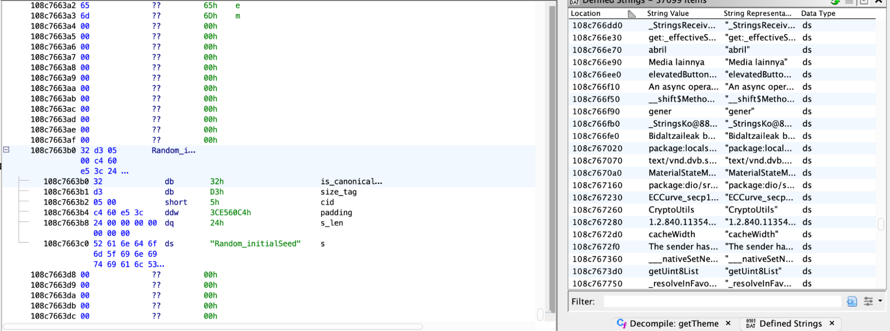

### Giving X27 a Value

The objects are defined, but the code still loads them through X27, whose value Ghidra doesn't know. In this example from `getTheme`, Ghidra can't tell which object is loaded:

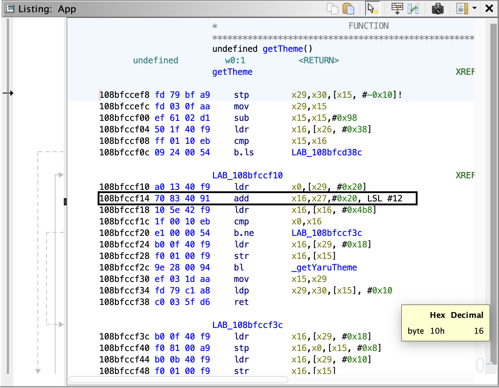

Ghidra's Register Manager can assign a register a fixed value over a range of addresses. X27 holds the object pool address throughout Dart code, so we assign it that value for the whole code section. Find the start and end of the `__text` section in the Memory Map; here they are `0x108bc2c000` and `0x108c2c323f`:

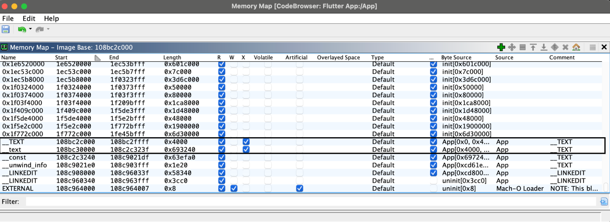

Open **Window > Register Manager**:

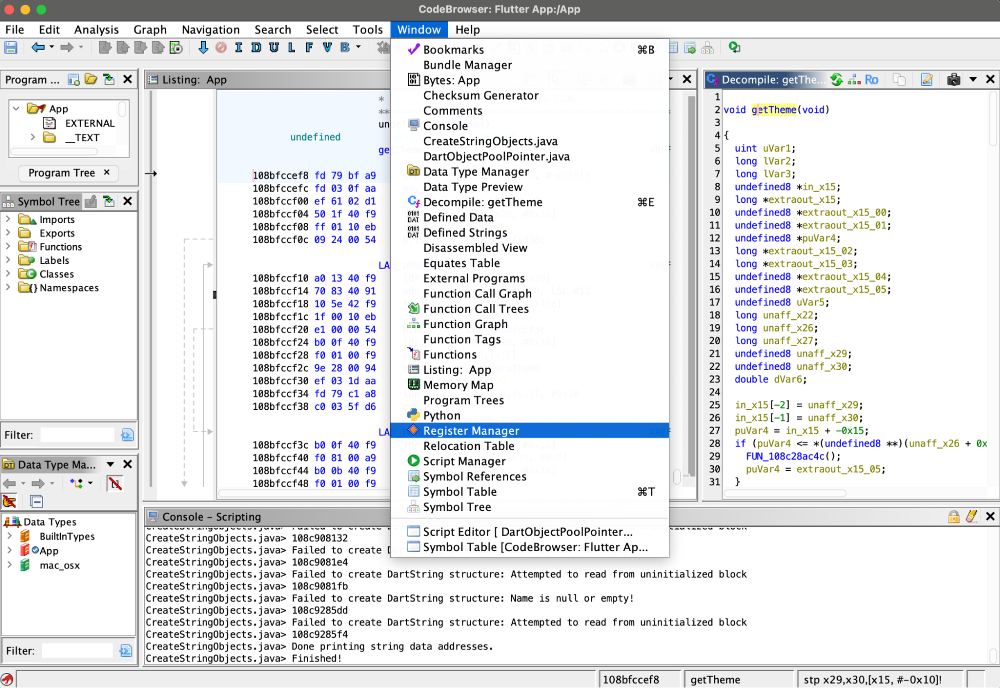

Select **X27**, set the start and end addresses to the `__text` section, and set the value to the object pool address (X27 from the dump output, `0x10a180080` here):

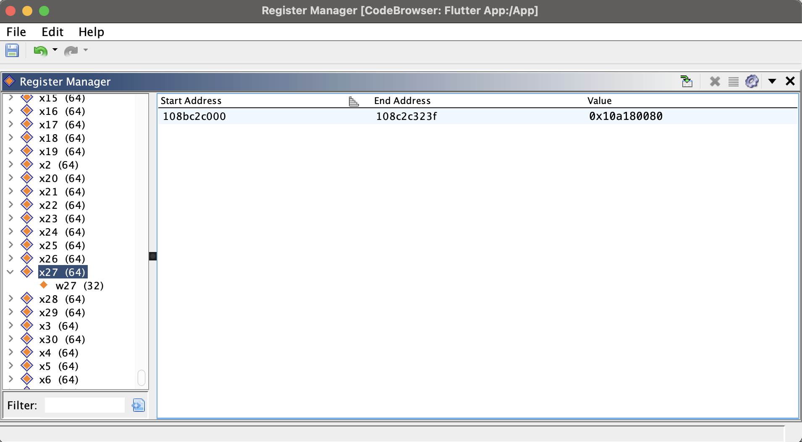

Ghidra only uses the new value when it analyzes the code again. Run **Analysis > Auto Analyze**, keep the default analyzers selected, and click **Analyze**. When it finishes, object pool loads resolve to the objects they load:

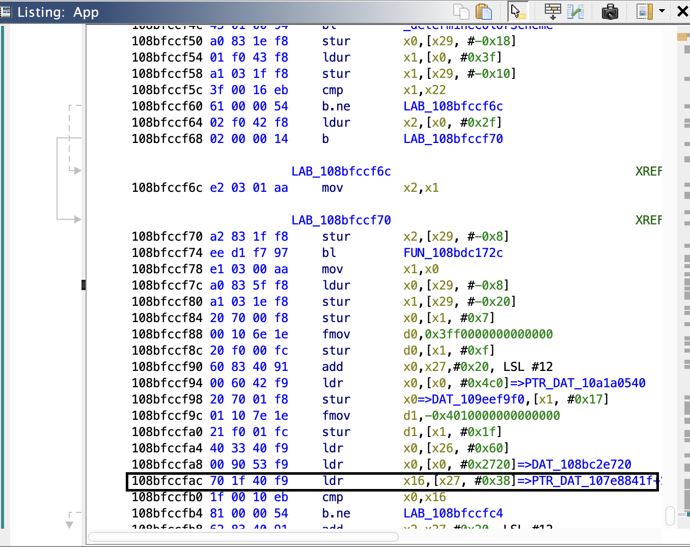

Cross-references now work in both directions, so you can list every place in the code that uses a given Dart object:

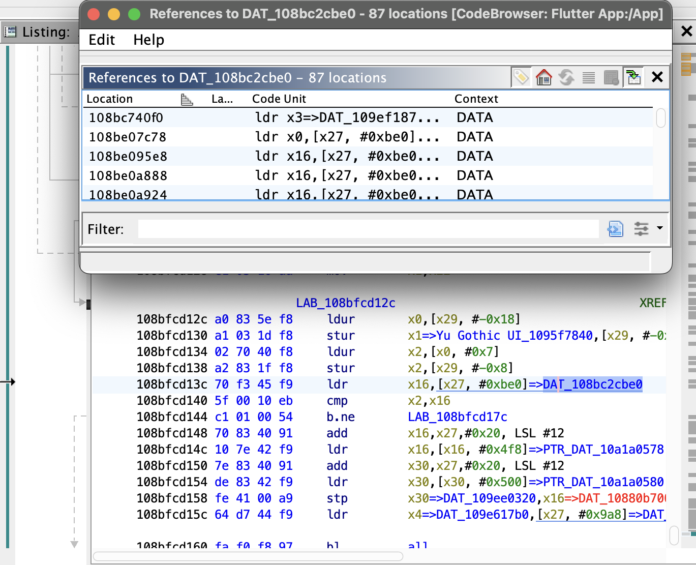

## Fixing the Dart VM Stack

With references restored, the next problem is the stack. On ARM64, Dart code doesn't use the system stack. It keeps its own stack, managed by the Dart VM, with **X15** as the stack pointer. A caller pushes arguments onto that stack and moves X15; local variables live there too, accessed through X15 or the frame pointer (X29).

This defeats the heuristics Ghidra, like other decompilers, uses to find parameters and local variables, so it finds none.

The fix is to rewrite every instruction that uses X15 so that it uses SP instead. The script below re-assembles the instructions in an address range with X15 replaced by SP (set `START_ADDRESS` and `END_ADDRESS` to the function you're analyzing):

```java
// Dart code on ARM64 uses X15 as its own stack pointer instead of SP, which
// stops Ghidra from recognizing parameters and local variables. This script
// re-assembles every instruction in an address range with X15 replaced by SP.
//
// Save as PatchDartStackPointer.java. Set START_ADDRESS and END_ADDRESS to the
// function (or range) to patch. This modifies the program's bytes.
//
//@author Neel Patel
//@category Flutter

import java.util.ArrayList;
import java.util.List;
import java.util.regex.Pattern;

import ghidra.app.plugin.assembler.Assembler;
import ghidra.app.plugin.assembler.Assemblers;
import ghidra.app.script.GhidraScript;
import ghidra.program.model.address.Address;
import ghidra.program.model.address.AddressSet;
import ghidra.program.model.lang.Register;
import ghidra.program.model.listing.Instruction;
import ghidra.program.model.listing.InstructionIterator;

public class PatchDartStackPointer extends GhidraScript {

    /** Range to patch (inclusive). Example: the getTheme function. */
    private static final long START_ADDRESS = 0x108bfccef8L;
    private static final long END_ADDRESS = 0x108bfccf68L;

    /** Matches the register name "x15" on its own (not as part of another word). */
    private static final Pattern X15 = Pattern.compile("\\bx15\\b");

    @Override
    public void run() throws Exception {
        Register x15 = currentProgram.getRegister("x15");
        AddressSet range = new AddressSet(toAddr(START_ADDRESS), toAddr(END_ADDRESS));

        // Collect first: re-assembling replaces instructions, which would disturb the iterator.
        List<Instruction> toPatch = new ArrayList<>();
        InstructionIterator instructions = currentProgram.getListing().getInstructions(range, true);
        while (instructions.hasNext()) {
            Instruction instruction = instructions.next();
            if (usesRegister(instruction, x15)) {
                toPatch.add(instruction);
            }
        }

        Assembler assembler = Assemblers.getAssembler(currentProgram);
        int patchedCount = 0;
        for (Instruction instruction : toPatch) {
            monitor.checkCancelled();
            Address address = instruction.getAddress();
            String original = instruction.toString();
            String patched = X15.matcher(original).replaceAll("sp");
            try {
                assembler.assemble(address, patched);
                patchedCount++;
                println(address + ": " + original + "  ->  " + patched);
            } catch (Exception e) {
                printerr("Failed to patch " + address + " (" + original + "): " + e.getMessage());
            }
        }

        println(String.format("Patched %d of %d instructions that use x15.", patchedCount, toPatch.size()));
    }

    /** True if any operand of {@code instruction} refers to {@code register}. */
    private static boolean usesRegister(Instruction instruction, Register register) {
        for (int operand = 0; operand < instruction.getNumOperands(); operand++) {
            for (Object part : instruction.getOpObjects(operand)) {
                if (register.equals(part)) {
                    return true;
                }
            }
        }
        return false;
    }
}
```

Before running the script:

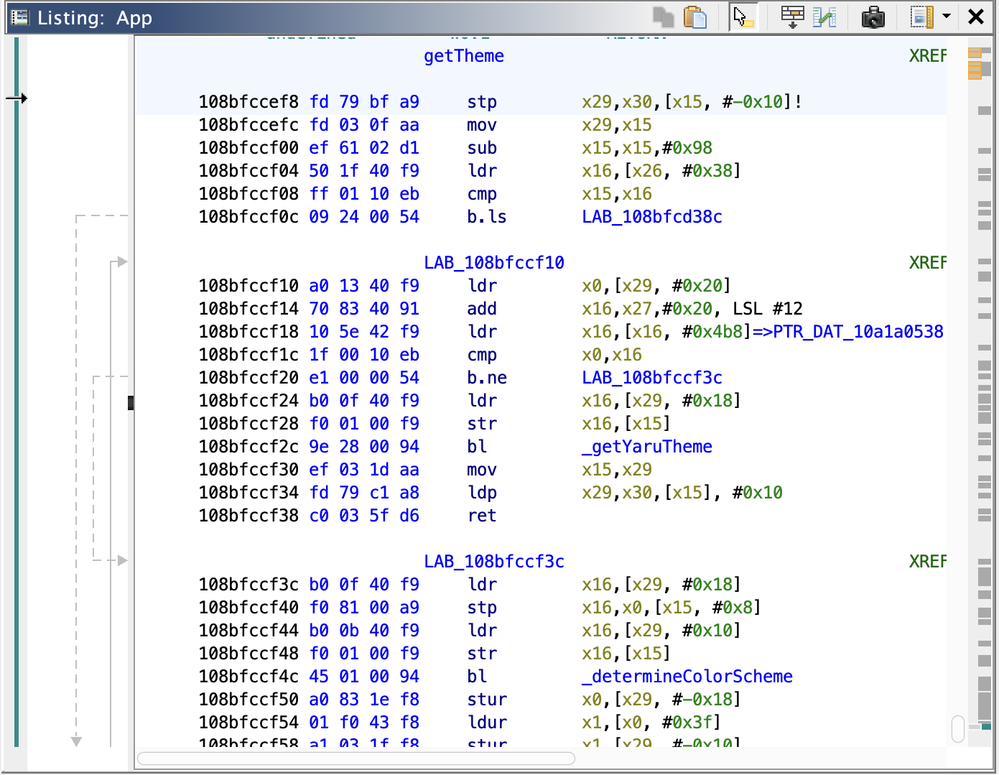

After running the script:

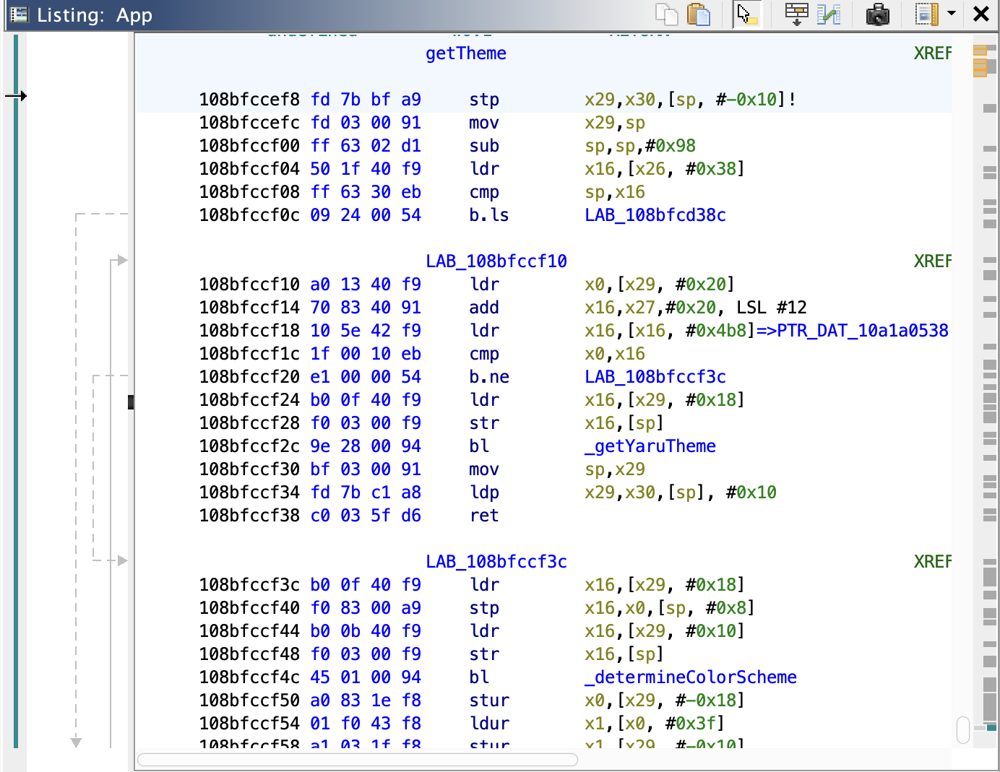

Ghidra now treats the Dart stack as the regular stack.

## Fixing Function Parameters

Patching the stack exposes the second half of the parameter problem. Ghidra still analyzes Dart functions with the standard ARM64 calling convention, which says the first arguments arrive in X0–X7 and only the rest on the stack. So it now finds the real arguments on the stack, but still assumes false arguments in X0–X7.

Dart code passes its parameters on the stack only, so the fix is to describe that to Ghidra as a custom calling convention and apply it to Dart functions.

Ghidra can add calling conventions to a program through **specification extensions**. Save the following as `dartcall.xml`:

```xml
<!-- Dart AOT calling convention on ARM64 (after X15 has been patched to SP):
     every parameter is on the stack, the return value is in X0. -->
<prototype name="__dartcall" extrapop="0" stackshift="0">
  <input>
    <pentry minsize="1" maxsize="500" align="8">
      <addr offset="0" space="stack"/>
    </pentry>
  </input>
  <output>
    <pentry minsize="1" maxsize="8">
      <register name="x0"/>
    </pentry>
  </output>
  <unaffected>
    <register name="sp"/>
    <register name="x29"/>
  </unaffected>
</prototype>
```

Then open **Edit > Options for** (your program) **> Specification Extensions**, click **Import** and choose `dartcall.xml`. `__dartcall` now appears alongside the built-in conventions.

To use it on a single function, open **Edit Function Signature** and pick `__dartcall` as the calling convention. To apply it to every function you've patched, run this script over the same range as the stack patch:

```java
// Applies the __dartcall calling convention (parameters on the stack only)
// to every function in an address range, so Ghidra stops assuming arguments
// in X0-X7. Import dartcall.xml as a specification extension first, and patch
// the range with PatchDartStackPointer.java.
//
// Save as ApplyDartCallingConvention.java. Set START_ADDRESS and END_ADDRESS
// to the range to update.
//
//@author Neel Patel
//@category Flutter

import ghidra.app.script.GhidraScript;
import ghidra.program.model.address.AddressSet;
import ghidra.program.model.listing.Function;
import ghidra.program.model.listing.FunctionIterator;

public class ApplyDartCallingConvention extends GhidraScript {

    /** Name of the calling convention defined in dartcall.xml. */
    private static final String DART_CALLING_CONVENTION = "__dartcall";

    /** Range to update (inclusive). Example: the getTheme function. */
    private static final long START_ADDRESS = 0x108bfccef8L;
    private static final long END_ADDRESS = 0x108bfccf68L;

    @Override
    public void run() throws Exception {
        if (currentProgram.getCompilerSpec().getCallingConvention(DART_CALLING_CONVENTION) == null) {
            printerr(DART_CALLING_CONVENTION + " isn't defined: import dartcall.xml under "
                    + "Edit > Options for the program > Specification Extensions first.");
            return;
        }

        AddressSet range = new AddressSet(toAddr(START_ADDRESS), toAddr(END_ADDRESS));
        FunctionIterator functions = currentProgram.getFunctionManager().getFunctions(range, true);
        int updatedCount = 0;
        while (functions.hasNext()) {
            monitor.checkCancelled();
            Function function = functions.next();
            function.setCallingConvention(DART_CALLING_CONVENTION);
            updatedCount++;
            println(function.getEntryPoint() + ": " + function.getName());
        }

        println(String.format("Applied %s to %d functions.", DART_CALLING_CONVENTION, updatedCount));
    }
}
```

With the stack patched and the calling convention applied, Ghidra stops inventing arguments in X0–X7 and the decompiled signature lists only the parameters actually passed on the stack. Arguments are pushed in order, so they appear in reverse: the last stack parameter is the function's first argument.

## Conclusion

Compiled Flutter apps resist reverse engineering less through deliberate protection than through tools assuming native conventions. Function names can be recovered at runtime with reFlutter. The missing links between code and data come from the object pool, and can be restored by dumping the Dart heap, defining the pool and its objects in Ghidra, and giving X27 its runtime value. The empty function signatures come from the Dart VM stack and calling convention, and are fixed by patching X15 to SP and describing Dart's convention to Ghidra.

After these steps, decompiled Dart code reads much like decompiled native code, which also means the security of a Flutter app shouldn't rest on how hard its Dart code is to read.

## References

### Research

- Boris Batteux, [Flutter™ Reverse Engineering: Current State and Future Outlook](https://www.guardsquare.com/blog/current-state-and-future-of-reversing-flutter-apps), Guardsquare, June 10, 2022.
- Boris Batteux, [Dart Decompilation and the Impact on Flutter™ App Security](https://www.guardsquare.com/blog/obstacles-in-dart-decompilation-and-the-impact-on-flutter-app-security), Guardsquare, June 29, 2022.
- Boris Batteux, [How Classical Attacks Apply to Frida Flutter™](https://www.guardsquare.com/blog/how-classical-attacks-apply-to-flutter-apps), Guardsquare, October 11, 2022.

The analysis of the Dart object pool, cross-references and the Dart VM stack in this guide builds on Guardsquare's research above, in particular *Dart Decompilation and the Impact on Flutter™ App Security*.

### Tools

- [reFlutter](https://github.com/Impact-I/reFlutter): Flutter reverse engineering framework, used to patch the app and dump Dart symbols (`dump.dart`).
- [Ghidra](https://ghidra-sre.org/): disassembler and decompiler, used for static analysis and the scripts in this guide.
- [Frida](https://frida.re/): dynamic instrumentation toolkit, used to locate and dump the Dart heap.
- [r2frida](https://github.com/nowsecure/r2frida): radare2 and Frida bridge, used to find the app's directories on the device.
- [JADX](https://github.com/skylot/jadx): Android decompiler, used to inspect the APK in the Android section.
- [LocalSend](https://localsend.org/) ([App Store](https://apps.apple.com/us/app/localsend/id1661733229)): the open-source app analyzed in this guide.
